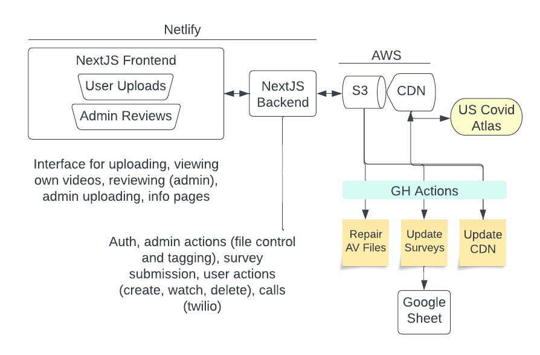
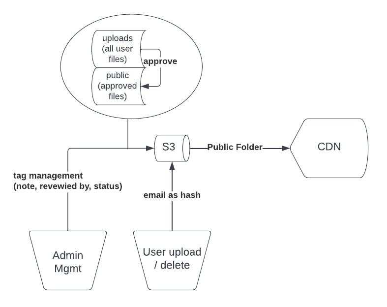
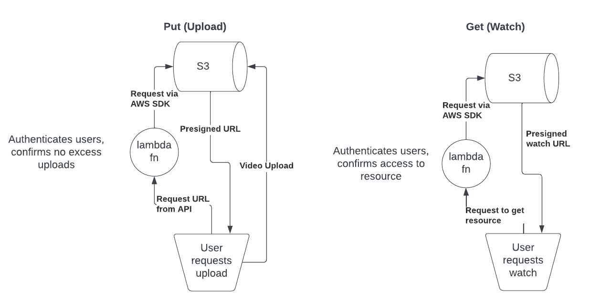

# covid-histories developer documentation

## Getting Started

Create `.env.local` from example and update variables as needed:

```bash
cp .env.local.example .env.local
```

Install dependencies:

```bash
yarn install
```

Run the development server:

```bash
yarn dev
```

Open [http://localhost:3000](http://localhost:3000) with your browser to see the
result.

You can start editing the page by modifying `pages/index.tsx`. The page
auto-updates as you edit the file.

[API routes](https://nextjs.org/docs/api-routes/introduction) can be accessed on
[http://localhost:3000/api/hello](http://localhost:3000/api/hello). This
endpoint can be edited in `pages/api/hello.ts`.

The `pages/api` directory is mapped to `/api/*`. Files in this directory are
treated as [API routes](https://nextjs.org/docs/api-routes/introduction) instead
of React pages.

## Build for deployment

If you want to build the site locally you can use this command:

```bash
yarn build
```

However, in production this is entirely handled by Netlify, the site is rebuilt on pushed to this repo.

Overview of entire production infrastructure.



## NextJS

This is a [Next.js](https://nextjs.org/) project bootstrapped with
[`create-next-app`](https://github.com/vercel/next.js/tree/canary/packages/create-next-app).

To learn more about Next.js, take a look at the following resources:

- [Next.js Documentation](https://nextjs.org/docs) - learn about Next.js
  features and API.
- [Learn Next.js](https://nextjs.org/learn) - an interactive Next.js tutorial.

You can check out
[the Next.js GitHub repository](https://github.com/vercel/next.js/) - your
feedback and contributions are welcome!

## AWS Configuration

The following resources must be provisioned in AWS. Enviroment variables will be used to connect to these resources.

### Prerequisites

#### IAM user

An IAM user must exist that had the following permissions:

- CloudFront
    - `CreateInvalidation`
- S3
    - `GetObject`
    - `GetObjectTagging`
    - `DeleteObject`
    - `PutObject`
    - `ListBucket`
    - `PutObjectTagging`
    - `PutObjectAcl`
  
For best practices, create a new Role `s3PresignedUploader` and attach these permissions to that role. Then create a new user `S3HistoriesUploader` (do not enable console access) and attach the new Role to the user.

Create an access key and download it. You will use these credentials in the `APP_AWS_ACCESS_KEY_ID` and `APP_AWS_SECRET_ACCESS_KEY` environment variables.

#### S3 Bucket

Create a new S3 bucket. In the Permissions tab, do the following:

1. Disable `Block public access`
2. Edit the bucket policy directly, and use this the following. Make sure to update `<bucket-name>` appropriately.

    ```
    {
      "Version": "2012-10-17",
      "Statement": [
        {
            "Sid": "CDN-Allow",
            "Effect": "Allow",
            "Principal": "*",
            "Action": "s3:GetObject",
            "Resource": "arn:aws:s3:::<bucket-name>/public/*"
        },
        {
            "Sid": "Statement1",
            "Effect": "Allow",
            "Principal": "*",
            "Action": "s3:GetObject",
            "Resource": "arn:aws:s3:::<bucket-name>/site_videos/*"
        }
      ]
    }
    ```
3. Edit the CORS policy:

    ```
    [
      {
        "AllowedHeaders": [
          "*"
        ],
      "AllowedMethods": [
          "GET",
          "PUT",
          "HEAD"
        ],
        "AllowedOrigins": [
            "*"
        ],
        "ExposeHeaders": [],
        "MaxAgeSeconds": 3000
      }
    ]
    ```

#### CloudFront Distribution

Create a new CloudFront distribution with an origin that points to the S3 bucket. Set the origin path to `/public`.

The id should be placed in `APP_AWS_CLOUDFRONT_DISTRIBUTION_ID` (todo: determine if this env variable is necessary??)

### Workflows Involving S3

The story submission and approval process uses tags on the objects that are uploaded to S3.



Presigned URLs are used to allow user upload directly to S3


